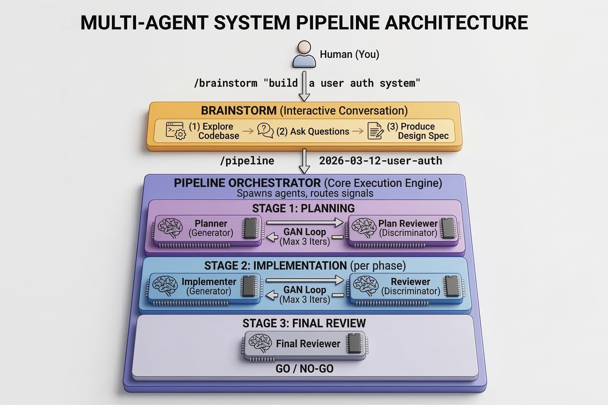

<p align="center">
  
</p>

<p align="center">
  <a href="https://opensource.org/licenses/MIT"></a>
  <a href="https://docs.anthropic.com/en/docs/claude-code"></a>
  
</p>

<p align="center">
 <a href="https://portfolio.hatstack.fun/read/post/Claude-Forge">Blog Post</a> · <a href="docs/ARCHITECTURE.md">Architecture Deep Dive</a>
</p>

Adversarial multi-agent pipeline for Claude Code. Separate AI agents generate and critique each other's work in GAN-style loops — generators produce artifacts, discriminators validate them, feedback drives convergence. Each agent runs in its own context window with fresh perspective.

## Install

```bash
# From the plugin marketplace (inside Claude Code)
/plugin install claude-forge

# Or install directly from GitHub
/plugin marketplace add hatmanstack/claude-forge
/plugin install claude-forge@claude-forge
```

Requires [Claude Code](https://docs.anthropic.com/en/docs/claude-code) v1.0.33+ and a git-initialized project.

## Skills

| Skill | Purpose | Output | Next Step |
|-------|---------|--------|-----------|
| `/claude-forge:brainstorm` | Interactive design session, explores codebase, asks scoping questions | `brainstorm.md` | `/claude-forge:pipeline` |
| `/claude-forge:audit` | Combined audit runner, select any combination of eval, health, docs | Multiple intake docs | `/claude-forge:pipeline` |
| `/claude-forge:repo-eval` | 3-evaluator panel scoring 12 pillars | `eval.md` | `/claude-forge:pipeline` |
| `/claude-forge:repo-health` | Technical debt audit across 4 vectors | `health-audit.md` | `/claude-forge:pipeline` |
| `/claude-forge:doc-health` | Documentation drift detection across 6 phases | `doc-audit.md` | `/claude-forge:pipeline` |
| `/claude-forge:pipeline` | Automated build/remediation cycle, routes by intake doc type | Committed code | Done |

### Usage

```bash
# Feature development
/claude-forge:brainstorm I want to add webhook support for payment events
/claude-forge:pipeline 2026-03-12-payment-webhooks

# Full audit (health > eval > docs) with one pipeline run
/claude-forge:audit all
/claude-forge:pipeline 2026-03-15-audit-my-app

# Or run individual audits (each creates its own plan directory)
/claude-forge:repo-eval
/claude-forge:pipeline 2026-03-15-eval-my-app
```

Resume any interrupted pipeline by re-running `/claude-forge:pipeline` with the same slug.

## Pipeline Flows

<p align="center">
  
</p>

### Feature (`brainstorm.md`)

```
Planner ↔ Plan Reviewer → Implementer ↔ Code Reviewer → Final Reviewer
         (max 3 iter)                   (max 3 iter/phase)    GO/NO-GO
```

### Repo Eval (`eval.md`)

```
3 Evaluators → Planner ↔ Plan Reviewer → Implementer ↔ Reviewer → Verify
(parallel)     (max 3)                   (max 3/phase)             verify findings
```

### Repo Health (`health-audit.md`)

```
Auditor → Planner ↔ Plan Reviewer → Hygienist ↔ Health Reviewer → Fortifier ↔ Health Reviewer → Verify
                                     [cleanup]                      [guardrails]                   verify findings
```

### Doc Health (`doc-audit.md`)

```
Doc Auditor → Planner ↔ Plan Reviewer → Doc Engineer ↔ Doc Reviewer → Verify
                                         [fix + prevent]               verify findings
```

## File Structure

```
claude-forge/
├── .claude-plugin/
│   └── plugin.json                 # Plugin manifest
├── skills/
│   ├── audit/SKILL.md              # Combined audit runner
│   ├── brainstorm/SKILL.md
│   ├── repo-eval/SKILL.md
│   ├── repo-health/SKILL.md
│   ├── doc-health/SKILL.md
│   └── pipeline/
│       ├── SKILL.md                # Orchestrator (routes by intake doc type)
│       ├── pipeline-protocol.md    # Signal protocol spec
│       ├── planner.md              # Shared across all flows
│       ├── plan_reviewer.md        # Shared across all flows
│       ├── implementer.md          # Feature + repo-eval flows
│       ├── reviewer.md             # Feature + repo-eval flows
│       ├── final_reviewer.md       # Feature flow only
│       ├── eval-hire.md            # The Pragmatist
│       ├── eval-stress.md          # The Oncall Engineer
│       ├── eval-day2.md            # The Team Lead
│       ├── health-auditor.md       # Pure assessment, no fix guidance
│       ├── health-hygienist.md     # Subtractive (delete, simplify)
│       ├── health-fortifier.md     # Additive (lint, CI, hooks)
│       ├── health-reviewer.md      # Reviews both hygienist + fortifier
│       ├── doc-auditor.md          # 6-phase drift detection
│       ├── doc-engineer.md         # Fix docs + add prevention
│       ├── doc-reviewer.md         # Reviews doc changes
│       └── flows/
│           ├── audit-flow.md       # Unified plan across multiple audit types
│           ├── repo-eval-flow.md
│           ├── repo-health-flow.md
│           └── doc-health-flow.md
├── docs/ARCHITECTURE.md
├── README.md
├── CHANGELOG.md
└── LICENSE
```

## License

MIT — see [LICENSE](LICENSE).
