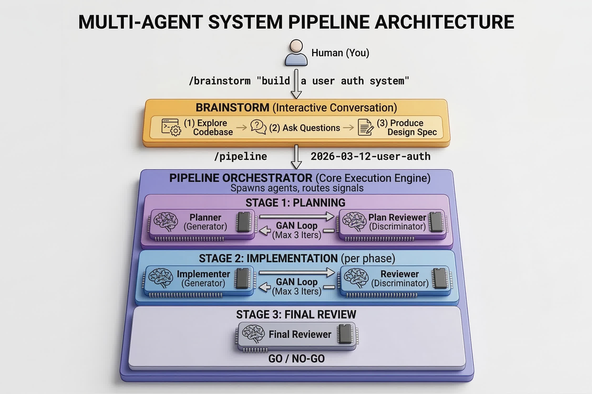

<p align="center">
  
</p>

<p align="center">
  <a href="https://opensource.org/licenses/MIT"></a>
  <a href="https://docs.anthropic.com/en/docs/claude-code"></a>
  
</p>

<p align="center">
 <a href="https://portfolio.hatstack.fun/read/post/Claude-Forge">Blog Post</a> · <a href="docs/ARCHITECTURE.md">Architecture Deep Dive</a> · <a href="https://portfolio.hatstack.fun/read/post/Jaeger-Tracing-In-Multi-Agent-Systems"> Tracing</a>
</p>

Adversarial multi-agent pipeline for Claude Code. Separate AI agents generate and critique each other's work in adversarial feedback loops, where generators produce artifacts, discriminators validate them, and iteration drives convergence. Each agent runs in its own context window with fresh perspective.

## Install

**Plugin** (marketplace):
```bash
/plugin marketplace add hatmanstack/claude-forge
/plugin install forge@claude-forge
/reload-plugins
```

The first command registers the marketplace (persisted to `~/.claude/plugins/known_marketplaces.json`, so you only do it once). The second opens the install TUI — select a scope and confirm. The third activates the plugin in your current session.

As a plugin, everything is namespaced `forge:`: the skills are `/forge:brainstorm`, `/forge:audit`, … and the pipeline workflow is `/forge:run`.

**Standalone** (copy into any project):
```bash
cp -r skills/ /path/to/your-project/.claude/skills/
cp -r agents/ /path/to/your-project/.claude/agents/
mkdir -p /path/to/your-project/.claude/workflows
cp workflows/run.js /path/to/your-project/.claude/workflows/
# Or personal (all projects): the same three directories under ~/.claude/
```

Copy `agents/` alongside the rest: the pipeline roles are native Claude Code subagents. A standalone install drops the `forge:` prefix, so the skills are `/brainstorm`, `/audit`, … the workflow is `/run`, and roles are addressed as `planner` rather than `forge:planner` (pass `standalone` to the workflow: `/run <plan-id> standalone`).

Requires a git-initialized project and a recent Claude Code with [dynamic workflows](https://code.claude.com/docs/en/workflows) available (on Pro, turn on *Dynamic workflows* in `/config`).

### Agent Teams (for the skills)

The skills (`brainstorm`, the audit skills, and the `pipeline` skill) coordinate agents with the `Agent` and `SendMessage` tools, which require an experimental flag. `/forge:run` does not: a workflow runs its own agents.

```bash
export CLAUDE_CODE_EXPERIMENTAL_AGENT_TEAMS=1
```

Add that line to your shell profile (`~/.bashrc`, `~/.zshrc`, …) and restart your terminal. Without it, skills that spawn or message agents fail.

## Commands

| Command | Kind | Purpose | Output |
|---------|------|---------|--------|
| `/forge:brainstorm` | skill | Interactive design session: explores the codebase, asks scoping questions | `brainstorm.md` |
| `/forge:audit` | skill | Any combination of eval, health, and docs audits in one plan directory | intake docs |
| `/forge:repo-eval` | skill | 3-evaluator panel scoring 12 pillars | `eval.md` |
| `/forge:repo-health` | skill | Technical-debt audit across 4 vectors | `health-audit.md` |
| `/forge:doc-health` | skill | Documentation drift detection across 6 phases | `doc-audit.md` |
| `/forge:run` | workflow | **The pipeline.** Plans, implements, and reviews from any intake doc | committed code + a verdict |
| `/forge:pipeline` | skill | The same pipeline, orchestrated turn by turn in your session | committed code |

Every skill is user-invoked (`disable-model-invocation: true`): Claude never starts a multi-agent run on its own, and the skill descriptions stay out of context in sessions that don't use Forge.

### Usage

```bash
# Feature development
/forge:brainstorm I want to add webhook support for payment events
/forge:run 2026-03-12-payment-webhooks

# Full audit (health > eval > docs), one remediation run
/forge:audit all
/forge:run 2026-03-15-audit-my-app

# Or a single audit (each creates its own plan directory)
/forge:repo-eval
/forge:run 2026-03-15-eval-my-app
```

## Running the Pipeline

`/forge:run` and `/forge:pipeline` run the same stages with the same roles. They differ in who holds the plan.

**`/forge:run` (recommended)** is a [workflow](https://code.claude.com/docs/en/workflows): a script (`workflows/run.js`) that the runtime executes in the background while your session stays free. The script owns the loop limits, resume entry points, and phase routing; every role returns a typed report, so a verdict is a schema field rather than text to parse, and a skipped or forged gate cannot happen by construction. Each iteration spawns a fresh agent that re-reads the plan files. Watch it with `/workflows`.

A workflow cannot stop to ask you anything, so `/forge:run` ends with a verdict rather than a question:

| Verdict | Meaning | Next |
|---------|---------|------|
| `GO` / `VERIFIED` | Feature production-ready / audit findings verified | Done |
| `NO-GO` / `UNVERIFIED` | Recorded in `feedback.md` with the issues | Fix by hand, or `/forge:run <plan-id> rework` to re-plan and continue |
| `MAX_ITERATIONS` | A plan or phase did not converge in 3 rounds | Read the open items in `feedback.md`, guide, then re-run |

**`/forge:pipeline`** orchestrates in your conversation: the main session spawns each role, continues it with `SendMessage` across iterations, and stops to ask you at NO-GO or unverified findings. Use it when workflows are unavailable, or when you want to steer between stages.

**Resume** either way by re-running with the same plan id. Both read the plan's state from `docs/plans/<plan-id>/`: plan and phase files, open review items, and the ordered `## Gate Log` in `feedback.md`, where every gate logs its decision. Approved phases are skipped; a phase with open feedback resumes at its implementer, one awaiting review at its reviewer.

## Pipeline Flows

<p align="center">
  
</p>

The intake doc in the plan directory picks the flow.

### Feature (`brainstorm.md`)

```
Planner ↔ Plan Reviewer → Implementer ↔ Code Reviewer → Final Reviewer
         (max 3 iter)                   (max 3 iter/phase)    GO/NO-GO
```

### Repo Eval (`eval.md`)

```
Calibrate → Planner ↔ Plan Reviewer → Implementer ↔ Reviewer → Verify
            (max 3)                   (max 3/phase)             VERIFIED/UNVERIFIED
```

### Repo Health (`health-audit.md`)

```
Planner ↔ Plan Reviewer → Hygienist ↔ Health Reviewer → Fortifier ↔ Health Reviewer → Verify
                          [cleanup]                      [guardrails]
```

### Doc Health (`doc-audit.md`)

```
Planner ↔ Plan Reviewer → Doc Engineer ↔ Doc Reviewer → Verify
                          [fix + prevent]
```

### Unified Audit (several intake docs)

One plan whose phases are tagged `[HYGIENIST]`, `[IMPLEMENTER]`, `[FORTIFIER]`, or `[DOC-ENGINEER]`; the tag picks each phase's implementer and reviewer. If verification leaves three or more findings unverified, the run re-plans them once before reporting.

## File Structure

```
claude-forge/
├── .claude-plugin/
│   ├── plugin.json                 # Plugin manifest
│   └── marketplace.json
├── agents/                         # Native subagents (the "team"), discovered as forge:<name>
│   ├── planner.md                  # Generator (opus)
│   ├── plan-reviewer.md            # Discriminator (opus)
│   ├── implementer.md              # Generator (sonnet), feature + repo-eval flows
│   ├── reviewer.md                 # Discriminator (opus), code review + verification
│   ├── final-reviewer.md           # Discriminator (opus), feature flow only
│   ├── eval-hire.md                # The Pragmatist (sonnet, read-only)
│   ├── eval-stress.md              # The Oncall Engineer (sonnet, read-only)
│   ├── eval-day2.md                # The Team Lead (sonnet, read-only)
│   ├── health-auditor.md           # Tech-debt assessment (sonnet, read-only)
│   ├── health-hygienist.md         # Generator (sonnet), subtractive
│   ├── health-fortifier.md         # Generator (sonnet), additive guardrails
│   ├── health-reviewer.md          # Discriminator (opus), hygienist + fortifier
│   ├── doc-auditor.md              # 6-phase drift detection (sonnet, read-only)
│   ├── doc-engineer.md             # Generator (sonnet), doc fixes + prevention
│   └── doc-reviewer.md             # Discriminator (opus)
├── workflows/
│   └── run.js                      # /forge:run: the pipeline as a Workflow script
├── skills/
│   ├── brainstorm/SKILL.md
│   ├── audit/SKILL.md              # Combined audit runner
│   ├── repo-eval/SKILL.md
│   ├── repo-health/SKILL.md
│   ├── doc-health/SKILL.md
│   └── pipeline/
│       ├── SKILL.md                # /forge:pipeline orchestrator (routes by intake doc)
│       ├── pipeline-protocol.md    # Signals, feedback.md, file ownership
│       └── flows/                  # audit, repo-eval, repo-health, doc-health
├── evals/                          # Tier B: claude plugin eval cases
├── evaluation/                     # Tiers A, C, D: contracts, trajectories, hook replay
├── hooks/
│   └── trace_subagents.py          # Optional OpenTelemetry tracing hook
├── bin/
│   └── install-tracing.sh          # Installs the hook and wires it into a project
├── docs/ARCHITECTURE.md
├── README.md
└── CHANGELOG.md
```

Each role is a **native Claude Code subagent**: its prompt is the file body; its tools and model are pinned in YAML frontmatter. Generators get write access (`Read, Write, Edit, Glob, Grep, Bash`); reviewers are restricted to `feedback.md` edits (`Read, Glob, Grep, Bash, Edit`); evaluators and auditors are read-only (`Read, Glob, Grep, Bash`); no role can spawn agents. Both runners spawn roles by type (`forge:planner`) and pass only the task; no role-prompt text is injected.

## Evaluation

Forge is itself an evaluation system, so it ships an evaluation harness for *its own* team: the regression net that keeps agents, tools, and orchestration honest as they change. It follows an evaluation pyramid (fast and deterministic at the base, realistic at the top):

- **Tier A — Contracts** (`evaluation/tier_a_contracts/`): agent frontmatter, per-role tool and model policy, wiring (`forge:<type>` references resolve), user-invoked skills, the workflow's model pins, and manifest consistency.
- **Tier B — Agent evals** (`evals/`): [`claude plugin eval`](https://code.claude.com/docs/en/plugin-evals) cases that run one agent against a scaffolded fixture and score it against plain Claude. Three reviewer cases: a spec violation, a standards violation, and a clean phase that must be approved.
- **Tier C — Trajectory** (`evaluation/tier_c_trajectory/`): governance-signal validators (no forged approvals, gate order, no skipped reviews), and `/forge:run`'s orchestration replayed against scripted agent replies (loop limits, resume entry points, tag routing).
- **Tier D — Traces** (`evaluation/tier_d_tracing/`): recorded Agent Teams hook events replayed through the tracing hook; live runs export to Jaeger with `security:dp{1..5}.*` spans.

```bash
python -m pip install pytest opentelemetry-sdk opentelemetry-exporter-otlp-proto-grpc
python -m pytest evaluation/ -v                                   # Tiers A, C, D
node --test evaluation/tier_c_trajectory/workflow_run.test.mjs    # /forge:run trajectories
claude plugin eval . --scaffold --allow-tools Bash Edit           # Tier B (LLM-costed)
```

See [evaluation/README.md](evaluation/README.md) for the full pyramid and the live-run trajectory check. CI runs Tiers A, C, and D on every push and pull request (`.github/workflows/evaluation.yml`); Tier B runs on demand.

## Tracing (optional)

Claude Forge ships an opt-in OpenTelemetry hook that traces every agent a run spawns, parented to a per-session root, so a pipeline run shows up as a single trace in Jaeger. Each agent gets an anchor span (keyed by the `agent_id` Claude Code puts on its hook events, so parallel evaluators never mix), its file mutations as child spans, and one `subagent_result` span per run segment (spawn or `SendMessage` resume) carrying its report, duration, and token usage. Agent and tool spans carry the OpenTelemetry GenAI attributes (`gen_ai.operation.name`, `gen_ai.agent.*`, `gen_ai.usage.*`), so agent-aware backends (Phoenix, Langfuse, Honeycomb) recognise them.

It is **off by default**. Without `CLAUDE_FORGE_TRACING=1` the hook is a no-op and cannot break a tool call.

### 1. Install Docker

Skip if you already have Docker.

```bash
sudo apt-get update
sudo apt-get install -y ca-certificates curl
sudo install -m 0755 -d /etc/apt/keyrings
sudo curl -fsSL https://download.docker.com/linux/debian/gpg -o /etc/apt/keyrings/docker.asc
sudo chmod a+r /etc/apt/keyrings/docker.asc
echo "deb [arch=$(dpkg --print-architecture) signed-by=/etc/apt/keyrings/docker.asc] https://download.docker.com/linux/debian $(. /etc/os-release && echo "$VERSION_CODENAME") stable" | sudo tee /etc/apt/sources.list.d/docker.list > /dev/null
sudo apt-get update
sudo apt-get install -y docker-ce docker-ce-cli containerd.io docker-buildx-plugin docker-compose-plugin
sudo usermod -aG docker $USER
newgrp docker
```

> Ubuntu users: replace both `linux/debian` URLs with `linux/ubuntu`.

### 2. Run Jaeger v2

```bash
docker run -d --name jaeger --restart unless-stopped \
  -p 16686:16686 -p 4317:4317 -p 4318:4318 \
  jaegertracing/jaeger:latest
```

That gets you the UI at <http://localhost:16686> and OTLP/gRPC ingestion on `:4317`. Storage is in-memory — traces are lost on container restart, which is fine for local development.

### 3. Install the tracing hook

From a clone of this repo:

```bash
cd your-project   # the project where you'll run the pipeline
bash /path/to/claude-forge/bin/install-tracing.sh
```

If you installed Claude Forge as a plugin (`/plugin install forge@claude-forge`), the script ships *inside* the plugin install directory. Locate and run it the same way:

```bash
cd your-project
bash "$(find ~/.claude -path '*/forge*/bin/install-tracing.sh' 2>/dev/null | sort -V | tail -1)"
```

> ⚠️ The `sort -V | tail -1` picks the **latest** cached plugin version. Plain `head -1` will silently pick whatever filesystem iteration order returns first — which is *not* always the newest after you've done a few upgrades, and will roll your deployed hook back to a stale snapshot.

The script:
- Creates a dedicated venv at `~/.local/share/claude-forge/venv` (uses [`uv`](https://astral.sh/uv) if installed, otherwise `python3 -m venv`)
- Installs `opentelemetry-api`, `opentelemetry-sdk`, `opentelemetry-exporter-otlp-proto-grpc` into that venv
- Copies the hook to `~/.local/share/claude-forge/trace_subagents.py`
- Merges hook entries into `./.claude/settings.local.json` (preserves any existing keys). Tool hooks match only the tools traced by default, and every event except `PreToolUse`, `SubagentStart`, and `SessionEnd` runs as an async hook, so tracing never delays a tool call
- Self-tests: runs the hook end-to-end and probes the OTLP endpoint

Flags: `--no-settings` (install only, print snippet), `--all-tools` (hook every tool call; needed for `CLAUDE_FORGE_TRACE_INNER` or Bash spans), `--uninstall` (remove the venv + hook).

**Tip — alias it.** You'll re-run this command per-project (one-time wiring) and after every claude-forge release (to refresh the shared hook). Add to `~/.bashrc` (or `~/.zshrc`) once:

```bash
forge-trace() {
  local s
  # IMPORTANT: sort -V | tail -1 picks the LATEST cached plugin version.
  # Plain `head -1` returns whatever filesystem iteration order produces,
  # which silently picks an old version once you've upgraded — making
  # forge-trace roll your hook back to a stale snapshot.
  s=$(find ~/.claude -path '*/forge*/bin/install-tracing.sh' 2>/dev/null | sort -V | tail -1)
  [[ -z "$s" ]] && { echo "forge plugin not installed"; return 1; }
  bash "$s" "$@"
}
```

Then it's just `forge-trace` (or `forge-trace --no-settings`, `forge-trace --uninstall`) from any project.

### 4. Opt in

Add to your shell init (`~/.bashrc`, `~/.zshrc`, etc.) and restart your terminal:

```bash
export CLAUDE_FORGE_TRACING=1
# optional override; defaults to http://localhost:4317. Standard OTLP env vars apply:
# OTEL_EXPORTER_OTLP_HEADERS for auth, and https:// endpoints use TLS.
export OTEL_EXPORTER_OTLP_ENDPOINT=http://localhost:4317
```

Restart Claude Code from that shell, run the pipeline, then open <http://localhost:16686> and pick the `claude-forge` service. To disable, unset the env var (or run `bash bin/install-tracing.sh --uninstall`).

### Updating tracing

> ⚠️ **Three commands, in order.** Plugin updates are layered: the marketplace index, the installed plugin version, and the deployed hook are independent. Skip a step and you'll silently roll back to whatever was installed last.

```
/plugin marketplace update claude-forge    # 1. refresh marketplace metadata (knows which versions exist)
/plugin install forge@claude-forge         # 2. UPGRADE the installed plugin to the latest version
                                           #    (writes ~/.claude/plugins/cache/claude-forge/forge/<NEW_VERSION>/)
```

then in a shell, from any project:

```bash
forge-trace                                # 3. deploy the refreshed hook (copies plugin cache → ~/.local/share/claude-forge/)
# or, without the alias:
bash "$(find ~/.claude -path '*/forge*/bin/install-tracing.sh' 2>/dev/null | sort -V | tail -1)"
```

**Why all three:** `/plugin marketplace update` only refreshes the *index* of available versions — it does not touch any installed plugin. `/plugin install forge@claude-forge` is what actually upgrades your installed plugin to the new version. Without that step, the plugin cache stays at whatever version you originally installed (e.g. `forge/1.3.2/`), and `forge-trace` will dutifully copy *that* old hook on top of any newer one you'd manually deployed — silently rolling back your tracing.

Verify after the three commands:

```bash
ls ~/.claude/plugins/cache/claude-forge/forge/             # should list the new version directory
grep -c _handle_subagent_stop ~/.local/share/claude-forge/trace_subagents.py   # should be > 0 (proves the deployed hook is current)
```

The deployed hook lives at `~/.local/share/claude-forge/trace_subagents.py`. Every project's `settings.local.json` points to that absolute path, so **all projects pick up the new hook automatically** on their next tool call — no per-project re-run and no Claude Code restart needed.

### Other tracing knobs

| Variable | Default | Purpose |
|---|---|---|
| `CLAUDE_FORGE_TRACING` | unset | Master on/off — hook is a no-op without this |
| `CLAUDE_FORGE_TRACE_MUTATIONS` | `1` (on) | Trace each subagent's mutational tool calls as child spans. On by default — these show *what* each subagent changed. Set to `0` for pure agent-level traces. |
| `CLAUDE_FORGE_TRACE_MUTATION_TOOLS` | `Write,Edit,MultiEdit,NotebookEdit` | Comma-separated list of tools traced as mutations. `Bash` is **excluded by default** because pipeline runs invoke it hundreds of times (git, npm, tests, ls) and the noise drowns out Write/Edit visibility. Add it back via `CLAUDE_FORGE_TRACE_MUTATION_TOOLS="Write,Edit,MultiEdit,NotebookEdit,Bash"` and install with `--all-tools` if you need Bash spans. |
| `CLAUDE_FORGE_TRACE_INNER` | unset | Also trace *non-mutational* inner tools (Read/Glob/Grep/etc.). Off by default — a pipeline run can fire 200+ such calls. Requires installing with `--all-tools`. |
| `CLAUDE_FORGE_TRACE_TOOL_BLOCKLIST` | `Read,Glob,Grep,TodoWrite,NotebookRead` | When inner tracing is on, comma-separated tools to skip. Empty string disables the blocklist |
| `CLAUDE_FORGE_TRACE_SECURITY` | `1` (on) | Defense-in-depth detection layer (see below). Emits `security:dp{1..5}.*` spans and a per-session summary. Detection only — never blocks a tool call. Set `0` to disable. |
| `CLAUDE_FORGE_SECURITY_INJECTION_EXTRA` | unset | Optional extra regex appended to the DP1 instruction-injection pattern set (for repo-specific markers) |
| `OTEL_EXPORTER_OTLP_ENDPOINT` | `http://localhost:4317` | OTLP/gRPC endpoint for any backend (Jaeger, Tempo, Honeycomb, etc.). `https://` endpoints use TLS; `OTEL_EXPORTER_OTLP_HEADERS` supplies auth headers |
| `CLAUDE_FORGE_PHASE_TARGET_TOKENS` | `150000` | Target token budget per pipeline phase (Stage size). Read by the Planner when sizing phases and by the Plan Reviewer when judging them. Smaller values produce more, smaller phases; larger values produce fewer, larger phases. |
| `CLAUDE_FORGE_PHASE_MAX_TOKENS` | `250000` | Hard ceiling per phase — Planner must not exceed this and Plan Reviewer flags phases above it (context-pressure risk). |

### Alongside Claude Code's native telemetry

Claude Code can export its own OpenTelemetry traces (beta: `CLAUDE_CODE_ENABLE_TELEMETRY=1`, `CLAUDE_CODE_ENHANCED_TELEMETRY_BETA=1`, `OTEL_TRACES_EXPORTER=otlp`), with a span per model request and tool call and subagent spans nested under the Agent call. Point it at the same Jaeger for model-level latency and cost. The two are complementary: native telemetry shows *what the model did*; Forge's hook adds what native telemetry cannot express: agent reports, pipeline roles, governance signals, and the security layer below. They appear as separate traces, because Claude Code does not pass trace context to hook processes.

### Security tracing (defense in depth)

A multi-agent pipeline can be subverted without a single error in the logs — a poisoned file comment, a forged approval signal, or a reviewer that rubber-stamps. When `CLAUDE_FORGE_TRACING=1`, Forge adds a **passive detection layer** that makes those events visible in Jaeger. It reads each subagent's role from the `agent_type` Claude Code stamps on its hook events, and its actions from its own transcript — neither of which file/text content can forge — so it can attest signal provenance and audit consensus out of band. It is **detection only**: it never blocks a tool call or changes pipeline flow, and it's tuned for first-party repos (low false positives). Disable with `CLAUDE_FORGE_TRACE_SECURITY=0`.

Findings surface as `security:dp{1..5}.*` spans (red, status ERROR) plus `forge.security.*` attributes on the `session_complete` span (`findings_total`, per-DP counts, `flagged`, and a `signal_timeline`):

| Span | Defense point | Fires when |
|------|---------------|-----------|
| `security:dp1.injected_instruction` / `…forged_signal_in_input` | Input boundary | An agent read a file containing instruction-like text or a standalone gate token (e.g. an injected `PHASE_APPROVED`) |
| `security:dp2.shared_model_fanout` | Fan-out | ≥2 read-only assessors fanned out over the same input on the shared session model (correlated-compromise precondition) |
| `security:dp3.signal_forgery` | Inter-agent channel | A generator/assessor emitted a gate signal it isn't authorized to cast (forged ballot) |
| `security:dp4.approved_without_tests` / `…suspicious_command` | Tool boundary | A reviewer approved without running tests/build, or any agent ran a check-defeating command (`--no-verify`, `\|\| true`, …) |
| `security:dp5.aggregator_addressed_instruction` / `…decision_starvation` | Aggregation | An agent's output tried to instruct the orchestrator, or a reviewer only ever requested changes (denial of decision) |

Query `security.severity=high` in Jaeger to triage, or alert on `forge.security.flagged=true`. The frontmatter tool lockdown (reviewers can't mutate source; no agent gets `Agent`) is the matching *enforcement* layer — a blocked attempt shows up as a `permission_denied:*` span.

## License

MIT — see [LICENSE](LICENSE).
